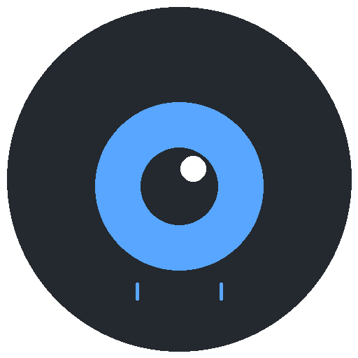

<p align="center">
  
</p>

<h1 align="center">ThirdEye.git</h1>

<p align="center">
  <a href="LICENSE"></a>
  
  
  
  
  
</p>

<p align="center">
  A desktop app for monitoring your GitHub repositories — pull requests, issues, notifications, and CI checks — all in one place.
</p>

---

## Features

- **Pull Requests & Issues** — View all your open PRs and issues across repositories with state indicators, labels, and CI check status.
- **Notifications** — Real-time GitHub notifications with unread indicators and the ability to mark as read.
- **OS Notifications** — Get native desktop notifications for new comments, state changes, CI completions, and merges.
- **Detail View** — Full PR/Issue detail with comments, diff stats, linked items, and the ability to post comments directly.
- **CI Check Status** — Monitor check runs (passing, failing, pending) for each pull request at a glance.
- **Dark & Light Mode** — GitHub Primer-inspired theme with automatic system theme detection.
- **Persistent Cache** — API responses are cached with ETag-based conditional requests and survive app restarts.
- **System Tray** — Runs in the background with an unread count badge in the system tray.
- **Auto-start** — Optional launch at system startup on macOS, Windows, and Linux.
- **Filter Controls** — Show/hide closed items, filter by repository, and manage watched/ignored repos.

## Installation

Download the latest release for your platform from the [Releases](../../releases) page:

| Platform | File | Distros |
|----------|------|---------|
| macOS (Universal) | `ThirdEye-x.x.x-mac-universal.dmg` | Intel & Apple Silicon |
| Windows | `ThirdEye-x.x.x-win-setup.exe` | Windows 10+ |
| Linux (deb) | `ThirdEye-x.x.x-linux-*.deb` | Debian, Ubuntu, Mint, Pop!_OS |
| Linux (rpm) | `ThirdEye-x.x.x-linux-*.rpm` | Fedora, RHEL, CentOS, openSUSE |
| Linux (AppImage) | `ThirdEye-x.x.x-linux-*.AppImage` | Any distro (no install needed) |

## Build from Source

### Prerequisites

- [Node.js](https://nodejs.org/) 18+
- npm 9+

### Steps

```bash
git clone https://github.com/jakduch/thirdeye.git
cd thirdeye
npm install
npm run build
npm start
```

### Package for Distribution

```bash
npm run dist:mac     # macOS Universal DMG
npm run dist:win     # Windows NSIS installer
npm run dist:linux   # Linux DEB package
```

## Configuration

On first launch, the app will ask for a GitHub Personal Access Token. Create one at [github.com/settings/tokens](https://github.com/settings/tokens) with the following scopes:

- `repo` — Full control of private repositories
- `notifications` — Access notifications

The token is stored locally via [electron-store](https://github.com/sindresorhus/electron-store) and never leaves your machine.

## Architecture

ThirdEye is an Electron application with a React frontend and a Node.js backend:

- **Main process** — GitHub API polling via [@octokit/rest](https://github.com/octokit/rest.js), notification management, system tray, and caching with ETag support.
- **Renderer process** — React 19 UI with Redux Toolkit for state management and Material UI components styled with GitHub Primer design tokens.
- **IPC bridge** — Type-safe communication between main and renderer processes.

## Acknowledgements

ThirdEye.git is built with the following open-source libraries:

| Library | License | Author(s) |
|---------|---------|-----------|
| [Electron](https://www.electronjs.org/) | MIT | OpenJS Foundation & Electron contributors |
| [React](https://react.dev/) | MIT | Meta Platforms, Inc. |
| [TypeScript](https://www.typescriptlang.org/) | Apache-2.0 | Microsoft Corporation |
| [@octokit/rest](https://github.com/octokit/rest.js) | MIT | Octokit contributors |
| [Redux Toolkit](https://redux-toolkit.js.org/) | MIT | Mark Erikson & Redux team |
| [Material UI](https://mui.com/) | MIT | MUI contributors |
| [electron-store](https://github.com/sindresorhus/electron-store) | MIT | Sindre Sorhus |
| [electron-builder](https://www.electron.build/) | MIT | electron-userland |
| [react-markdown](https://github.com/remarkjs/react-markdown) | MIT | Titus Wormer & unified collective |
| [remark-gfm](https://github.com/remarkjs/remark-gfm) | MIT | Titus Wormer & unified collective |
| [React Router](https://reactrouter.com/) | MIT | Remix Software, Inc. |
| [React Redux](https://react-redux.js.org/) | MIT | Dan Abramov & Redux team |
| [Emotion](https://emotion.sh/) | MIT | Emotion team & contributors |
| [webpack](https://webpack.js.org/) | MIT | JS Foundation & webpack contributors |

Thank you to all the maintainers and contributors of these projects.

## License

This project is licensed under the [BSD 3-Clause License](LICENSE).

Copyright (c) 2026, Jakub Duch.
